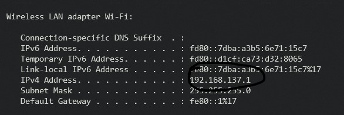

# REMOTE ACCESS

### Description:

Remote access is a command line interface that enables accessing other devices in your private network.

### Used technologies 

- Python
- TCP
- Sockets
- AF_INET
- Flask

### How to use ?
#### Steps

- Clone repo
- run app.py (But specify the ip that was granted by your router to access the server externally)

to get this ip you should type

```bash
ipconfig
```

then something like this



```python
app.run(host="<ip that you found>")
```


